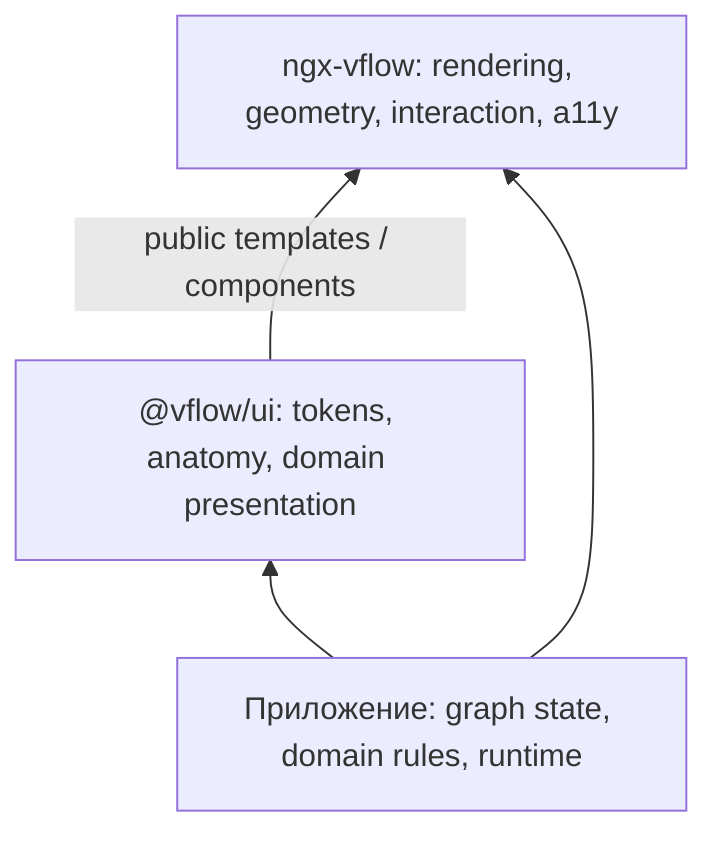

# Дизайн-система для ngx-vflow: исследование и предложение

Дата: 2026-09-06. Статус: исследование для обсуждения; названия будущих примитивов и этапы ниже — предложения, не утверждённый API. Код библиотеки не изменялся.

Уточнение автора: «таблицы» здесь означают **сущности и связи между строками** — ERD и schema mapping. Универсальный data grid не является целью.

## Основной вывод

`@vflow/ui` стоит развивать как **first-party extension для сборки node-based UI**: единый визуальный язык, небольшие составные примитивы, доменные представления и official recipes. Полезный результат — разработчик собирает свой workflow, ERD или BPMN-представление, сохраняя модель данных и дизайн приложения.

Предлагаемая структура продукта:

1. **Основа:** токены, состояния, анатомия ноды, визуальные части handles и рёбер, подписи, маркеры, действия.
2. **Доменные композиции:** workflow step, entity/field rows, события и gateways, контейнеры. Общая основа, разные визуальные соглашения.
3. **Official recipes:** approval flow, ERD, schema mapper, BPMN-представление, палитра и inspector в составе приложения.

Это уровни ответственности, а не предложение немедленно создавать три npm-пакета. Начать можно в существующем `libs/ui`.

Рынок подтверждает саму модель: [React Flow UI](https://reactflow.dev/ui) распространяет готовые части node-based UI отдельно от движка, а enterprise-решения предоставляют также доменные фигуры и инструменты редактора. Сравнение девяти подходов с первичными источниками находится в [отдельном обзоре](ecosystem-research.md).

## Что уже есть в репозитории

| Наблюдение                                                                             | Значение для проекта                                                          | Источник                                                                                                                                               |
| -------------------------------------------------------------------------------------- | ----------------------------------------------------------------------------- | ------------------------------------------------------------------------------------------------------------------------------------------------------ |
| `@vflow/ui` уже отдельный пакет с Angular peer dependency и самостоятельным CSS        | Не нужно заново проектировать выпуск пакета                                   | [package.json](../../libs/ui/package.json), [README](../../libs/ui/README.md)                                                                          |
| Tailwind 4, префикс `vui:`, без Preflight; потребитель получает готовый `styles.css`   | Сохранить потребление без Tailwind build step                                 | [styles.css](../../libs/ui/src/styles.css), [build](../../libs/ui/project.json)                                                                        |
| Пока есть только `VflowButton`, использующий конкретные indigo/white utilities         | Есть сборочная основа, но публичной семантической системы токенов ещё нет     | [button.directive.ts](../../libs/ui/src/lib/button.directive.ts)                                                                                       |
| HTML для нод, handles, labels и toolbar; SVG для рёбер                                 | Строить ноды обычным Angular HTML; линиям нужны SVG-примитивы                 | [ADR-0001](../../docs/adr/0001-native-html-node-rendering.md)                                                                                          |
| Граф принадлежит приложению; структурные изменения запрашиваются                       | UI не должен заводить второй authoritative graph store                        | [ADR-0002](../../docs/adr/0002-application-owned-graph-state.md)                                                                                       |
| Любая нода может быть parent node                                                      | Визуальный контейнер и родительство — разные понятия                          | [ADR-0003](../../docs/adr/0003-allow-any-node-to-be-a-parent.md)                                                                                       |
| Роли wrapper, focus и вычисляемая ARIA принадлежат core                                | Перенос оформления не переносит ответственность за accessibility в приложение | [ADR-0004](../../docs/adr/0004-library-owned-accessibility-wrappers.md)                                                                                |
| Есть HTML/template/component nodes, edge template, handle template, gesture exclusions | Это существующие seams для композиции; сначала использовать их                | [public API](../../libs/ngx-vflow/src/public-api.ts), [template contexts](../../libs/ngx-vflow/src/lib/vflow/interfaces/template-context.interface.ts) |

Предложения ниже согласуются с этими ADR. Полностью унести wrappers, interaction policy или авторитетное состояние в UI означало бы пересмотр соответствующих решений.

## Карта бизнес-кейсов

Это **карта потенциального применения**, а не доказательство спроса и не рейтинг популярности. Источники подтверждают семейства сценариев и паттерны; конкретные бизнес-примеры — наша экстраполяция. Несколько отраслей с одинаковой формой интерфейса не должны порождать отдельный компонент на каждую отрасль.

### Процессы и автоматизация

Документальная основа: [Node-RED nodes](https://nodered.org/docs/user-guide/editor/workspace/nodes) показывает порты, статусы и ошибки конфигурации; [AWS Step Functions states](https://docs.aws.amazon.com/step-functions/latest/dg/workflow-states.html) — задачи, выбор, параллельные ветви, обработку коллекций и ожидание; [Camunda BPMN reference](https://camunda.com/bpmn/reference/) — задачи, события, gateways и участников процесса.

| №   | Пользователь и задача                                | Повторяющееся UI                                           | Что остаётся у приложения / отдельной extension |
| --- | ---------------------------------------------------- | ---------------------------------------------------------- | ----------------------------------------------- |
| 01  | Финансы: согласовать счёт по сумме и подразделению   | Task card, assignee, условные выходы, SLA, approval status | Правила согласования, права, аудит              |
| 02  | HR: построить onboarding сотрудника                  | Этапы, чек-лист, параллельные задачи, ожидание             | Интеграции с HR/IT, персональные данные         |
| 03  | Закупки: заказ → поставка → приёмка                  | Подпроцесс, документы, исключения, владельцы               | ERP-модель и исполнение                         |
| 04  | Страхование: обработать обращение с ручной проверкой | Decision, human task, возврат на исправление               | Расчёт, полномочия, бизнес-валидация            |
| 05  | Поддержка: маршрутизация заявки и эскалация          | Router, queue, таймер, ветка ошибки                        | Очереди, расписания, SLA engine                 |
| 06  | Маркетинг: настроить коммуникационную цепочку        | Trigger, delay, ветвление, channel icon, outcome           | Рассылки, сегменты, эксперименты                |
| 07  | Интегратор: webhook → преобразование → CRM           | Подписанные порты, connection status, retry badge          | Коннекторы, credentials, retries                |
| 08  | DevOps: pipeline сборки и выкладки                   | Job, parallel group, manual gate, run status               | CI runner, артефакты, секреты                   |
| 09  | Операции: отследить выполнение заказа                | Та же схема в режиме наблюдения, текущий шаг, duration     | Подписка на события и привязка к execution ID   |
| 10  | Аналитик: описать BPMN collaboration                 | Pool/lane, task, event, gateway, разные виды связи         | BPMN model, правила, XML и executable semantics |

### Данные и связи между полями

Документальная основа: [React Flow Database Schema Node](https://reactflow.dev/ui/components/database-schema-node) связывает handles со строками схемы; [Azure mapping data flow](https://learn.microsoft.com/en-us/azure/data-factory/concepts-data-flow-schema-drift) показывает необходимость учитывать изменяющиеся схемы. Подробные field-to-field примеры GoJS и Foblex приведены в [обзоре аналогов](ecosystem-research.md).

| №   | Пользователь и задача                              | Повторяющееся UI                                        | Что остаётся у приложения / отдельной extension |
| --- | -------------------------------------------------- | ------------------------------------------------------- | ----------------------------------------------- |
| 11  | DBA: спроектировать ERD                            | Entity header, field row, type, PK/FK, cardinality      | SQL dialect, DDL, миграции                      |
| 12  | Интегратор: сопоставить CRM и ERP                  | Две сущности, row ports, mapping links, unmatched state | Совместимость типов, выражения преобразования   |
| 13  | Разработчик API: сопоставить JSON/XML структуры    | Вложенные поля, optional/array badges, пути полей       | Парсинг схем, раскрытие сложных типов           |
| 14  | Data engineer: собрать ETL/ELT                     | Source/transform/sink, входы и выходы, schema summary   | Вычисления, запуск, metadata discovery          |
| 15  | Аналитик данных: исследовать column lineage        | Строки колонок, выделение upstream/downstream           | Извлечение lineage и хранение метаданных        |
| 16  | Аналитик: собрать visual SQL join                  | Entity rows, join type label, relationship ports        | SQL generation и проверка запроса               |
| 17  | Команда миграции: сопоставить старую и новую схему | Added/removed/changed rows, связи, diagnostics          | Diff модели, план миграции                      |
| 18  | MDM: настроить правила объединения полей           | Mapping rows, merge operation, приоритет источника      | Entity resolution, конфликты и provenance       |

### AI, логика и интерактивные продукты

Документальная основа: [Langflow components](https://docs.langflow.org/concepts-components) использует типизированные и динамические порты; [Stately](https://stately.ai/docs/studio) моделирует состояния и переходы; [Rete](https://retejs.org/docs/) отделяет визуализацию nodes/sockets/controls от обработки графа. [Camunda DMN](https://docs.camunda.io/docs/components/modeler/dmn/decision-table-input/) показывает отдельную семантику таблиц решений.

| №   | Пользователь и задача                                 | Повторяющееся UI                                         | Что остаётся у приложения / отдельной extension |
| --- | ----------------------------------------------------- | -------------------------------------------------------- | ----------------------------------------------- |
| 19  | AI developer: собрать RAG pipeline                    | Typed ports, model/tool/data icons, preview slot, status | LLM execution, стоимость, credentials           |
| 20  | AI developer: оркестрировать агентов и human approval | Agent card, tool ports, nested flow, waiting status      | Agent runtime, memory, orchestration            |
| 21  | Conversation designer: чатбот / IVR                   | Message card, choices, fallback, terminal states         | Каналы, NLP, session state                      |
| 22  | Product designer: ветвящаяся анкета                   | Question, condition, answer ports, outcome               | Form engine, ответы, schema validation          |
| 23  | Game designer: диалог / quest graph                   | Scene/state card, condition edge, loop, entry/exit       | Игровая логика и runtime                        |
| 24  | Разработчик: state machine интерфейса                 | State, initial/final state, event/guard label, nesting   | XState/другой runtime, transition semantics     |
| 25  | Risk analyst: дерево решений / DMN                    | Decision, input/output summary, rule badge               | FEEL, hit policy, decision table editor         |
| 26  | Автор визуальных вычислений: math/audio/image graph   | Typed sockets, inline numeric controls, preview          | Вычислительный граф и обработка медиа           |

### Архитектура, мониторинг и исследование связей

Документальная основа: [каталог yFiles](https://www.yworks.com/products/yfiles/demos.html) содержит примеры network monitoring, fraud detection и supply chain. Это демонстрации применения библиотеки, а не готовые отраслевые приложения.

| №   | Пользователь и задача                                      | Повторяющееся UI                                        | Что остаётся у приложения / отдельной extension |
| --- | ---------------------------------------------------------- | ------------------------------------------------------- | ----------------------------------------------- |
| 27  | Архитектор: карта сервисов и зависимостей                  | Service card, environment container, labelled edges     | Discovery, модель архитектуры, auto layout      |
| 28  | SRE: видеть состояние сети / инфраструктуры                | Device nodes, health badges, traffic labels             | Телеметрия, агрегация, alerting                 |
| 29  | Аналитик безопасности: цепочки атак и доверия              | Entity nodes, directed relations, severity              | Детекция, threat model, risk scoring            |
| 30  | Fraud analyst: связи людей, счетов и транзакций            | Entity summary, typed relation, count, expansion action | Поиск, объединение сущностей, анализ графа      |
| 31  | Supply chain planner: зависимости поставщиков              | Entity card, quantities, dependency edge, status        | Оптимизация и расчёт запасов                    |
| 32  | Руководитель: оргструктура и ответственность               | Person/team cards, parent-child links, collapse action  | HR data и оргправила                            |
| 33  | Разработчик: dependency/build graph                        | Artifact card, version/status, dependency edge          | Анализ репозитория и build system               |
| 34  | Исследователь: knowledge graph и объяснение происхождения  | Entity card, relation labels, evidence slot             | Поиск, reasoning, persistence                   |
| 35  | Фасилитатор: карта процесса на воркшопе                    | Простая нода, группа, annotation, лёгкая связь          | Collaboration, комментарии, версии              |
| 36  | Владелец процесса: сравнить проект и опубликованную версию | Added/changed/removed presentation, badges              | Graph diff, versioning, approval workflow       |

### Что эта широта действительно доказывает

Повторяются не отраслевые сущности, а **шесть визуальных архетипов**:

| Архетип                      | Примеры                                  | Основа                                                      |
| ---------------------------- | ---------------------------------------- | ----------------------------------------------------------- |
| Карточка действия / сущности | Human task, service, agent, person       | Surface + header + content + metadata/actions               |
| Сущность со строками-портами | ERD, schema mapper, lineage, API schema  | Surface + field rows + labels + handles                     |
| Событие / терминатор         | Trigger, timer, start/end                | Shape + icon + external label                               |
| Развилка / слияние           | Workflow decision, gateway, router       | Shape/card + несколько подписанных выходов                  |
| Контейнер                    | Stage, lane, subprocess, environment     | Frame + header; явная связь с parent node при необходимости |
| Связь с семантикой           | Transition, mapping, dependency, message | SVG stroke + markers + HTML labels/actions                  |

Продуктовый приоритет не следует из числа строк таблицы. Начальный выбор workflow + ERD/mapping + BPMN ниже основан на запросе автора и различии требований, а не на неподтверждённом размере рынка.

## Общие правила дизайн-системы

1. **Композиция вместо универсального NodeConfig.** Header, field row, status и actions можно комбинировать. Не превращать общий компонент в union всех полей BPMN, SQL и AI. Простой элемент разметки не обязан быть отдельным Angular component: directive и CSS часто достаточны.
2. **Одинаковая анатомия, доменная визуальная грамматика.** Workflow task может быть карточкой. BPMN event/gateway должны сохранять узнаваемую нотацию; ERD должен оставаться читаемым набором полей. Не сводить всё к карточке одного размера.
3. **Независимые состояния.** `selected/focused` — взаимодействие; `valid/invalid` — проверка; `running/failed/waiting` — исполнение; `locked/read-only` — режим приложения. Нода может одновременно быть selected, invalid и waiting. Один общий `status` этого не выражает.
4. **Цвет имеет одну роль в конкретном канале.** Selection — outline, execution — отдельный индикатор с текстом/иконкой, тип поля — badge/label. Ошибка и выделение не должны перекрашивать друг друга. Направление не кодировать только цветом.
5. **Port представляет место связи, а не декоративную точку.** У него устойчивый ID, направление взаимодействия, label и доступность. Цвет SQL-типа не означает автоматически совместимость. UI показывает результат проверки; правила задаёт приложение через core.
6. **Edge — полноценный объект интерфейса.** Нужны читабельная подпись, состояния, selectable hit area, место действия и маркер. Геометрия и reconnect принадлежат core; UI использует готовый path.
7. **Режим наблюдения является полноценным сценарием.** Действия можно убрать, сохранив навигацию, названия и диагностику. `draggable=false` не делает всю ноду disabled. Read-only UI не заменяет права на сервере.
8. **Встроенные controls остаются обычными controls.** Нативные button/input, существующая дизайн-система приложения через slots, явное исключение из graph gestures там, где нужно. Не создавать обязательную копию Material/PrimeNG внутри `@vflow/ui`.
9. **Размер, zoom и текст входят в контракт.** Long labels, локализация, multiline fields и изменение шрифта влияют на геометрию. Маленький нарисованный handle и удобная область попадания — разные размеры. Внешний контур не должен обрезать handles и focus.
10. **Не заставлять потребителя знать внутренний DOM core.** Использовать public templates/context. Если не хватает конкретного hook — добавить узкий hook в core; не зависеть от `ɵ` services или цепочки `::ng-deep`.
11. **Application-owned state сохраняется.** UI action предлагает действие; приложение применяет structural graph operation. Изменения формы и execution state также принадлежат приложению. Ни NodeShell, ни palette не создают скрытый store.
12. **Дизайн-система включает правила и примеры.** Для каждого примитива документировать anatomy, states, keyboard/content behavior, token contract и композицию. Галерея несвязанных красивых нод этого не заменяет.

В терминах codebase-design: нужный **seam** уже находится между core rendering/interaction и пользовательским template. **Depth** UI-модуля — сколько повторяющихся правил он снимает с потребителей через небольшой **interface**. Компонент, который лишь переименовал `<div>`, оправдан только если стабилизирует реальную анатомию или поведение в нескольких композициях.

## Кандидаты в каталог

Названия рабочие. «Основа» означает первый согласованный объём, а не уже существующие exports.

| Приоритет             | Примитив / композиция                       | Для чего                                  | Предлагаемый объём                                                                          |
| --------------------- | ------------------------------------------- | ----------------------------------------- | ------------------------------------------------------------------------------------------- |
| Основа                | `NodeShell` + оформление header/body/footer | Workflow, entity, service, AI nodes       | Surface, slots, плотность, отображение selection; не graph wrapper                          |
| Основа                | `HandleVisual` / `PortLabel`                | Общие точки соединения                    | Skin поверх существующего handle template, label, valid/invalid/idle                        |
| Основа                | `FieldRow`                                  | ERD, mapping, lineage                     | Название, тип/metadata slots, anchors для handles с обеих сторон                            |
| Основа                | `EdgeStroke`                                | Default/custom edges и connection preview | Stroke, dash, selected/preselected, существующие marker URLs; path приходит из core         |
| Основа                | `EdgeLabel` presentation                    | Condition, relation name, counter         | HTML surface/content; позицию даёт core                                                     |
| Основа                | `StatusBadge` / indicator                   | Validation и наблюдение исполнения        | Несколько визуальных tones, icon/text slots; доменная строка статуса принадлежит приложению |
| Основа                | `GroupFrame`                                | Перенос default group, stages             | Frame/title/body presentation; не устанавливает parentId                                    |
| Основа                | `ActionButton` / оформление toolbar         | Нода и линия                              | Использовать существующий native `VflowButton`; icon-only требует accessible name           |
| Первый доменный набор | `EntityNode` recipe                         | ERD/schema mapping                        | Header + FieldRow + metadata; PK/FK/nullable и cardinality в ERD-композиции                 |
| Первый доменный набор | `WorkflowStep` recipe                       | Actions, triggers, decisions              | NodeShell + ports + status + actions; runtime вне recipe                                    |
| Первый доменный набор | BPMN visual primitives                      | Process modeling                          | См. отдельный объём ниже; не только три геометрические фигуры                               |
| Следующий кандидат    | `Annotation`, placeholder/add-step          | Объяснение и создание графа               | Сначала compositions; операция вставки принадлежит приложению                               |
| Следующий кандидат    | Node palette/search и inspector layout      | Сборка редактора                          | Official recipe с доступными controls; schemas/forms и команды принадлежат приложению       |
| По потребности        | Overview/detail representation              | Большие схемы                             | Сначала пример смены представления; отдельный контракт после проверки anchors/focus         |

Готовые `EntityNode`/`WorkflowStep` могут оставаться official recipes, пока не доказана повторяемость их interface. Не нужны сразу NodeFactory, registry DSL, универсальный renderer форм или архитектура плагинов.

## ERD и schema mapping: требования к строкам

Главный переиспользуемый элемент — **field row с anchor для handle**, а не data grid.

- Стабильный `field.id` отделён от `name`, позиции и отображаемого пути. Переименование и сортировка не должны ломать соединения. ID handle можно выводить из field ID и роли; уникальность определяется контрактом core.
- У строки есть label, type/metadata area и точки подключения. ERD может показывать PK/FK/nullable; mapper — mapping status; lineage — provenance. Это проекции разных моделей на общую анатомию.
- `source`/`target` в движке определяет взаимодействие. Направление FK и кардинальность отношений — бизнес-семантика, которую явно задаёт ERD recipe.
- Подписи у начала и конца связи должны позволять выразить cardinality. Настоящие crow's-foot markers — отдельная задача SVG presentation; существующий marker union нельзя считать уже поддерживающим их.
- Reorder, добавление поля, перенос текста и изменение density должны сохранять привязку к строке. В core уже есть измерение DOM anchors и размеров handles — использовать его, не вводить UI-измеритель.
- Scroll и collapse требуют отдельного контракта: что видно, куда идёт связь со скрытым полем, можно ли выбрать такое соединение. Не перепривязывать сохранённый endpoint к соседней видимой строке.
- Для первой версии: все строки обычным DOM, без внутренней виртуализации и без обещания корректной работы со скрытыми anchors. Большие сущности — следующий измеряемый сценарий. Collapse, если понадобится, должен сохранять реальные field IDs и иметь явное summary-представление.
- Compound keys, вложенные JSON-поля, массивы и many-to-many — расширения рецептов, а не повод сразу превращать FieldRow в schema engine.

Проверочная композиция должна включать обе задачи: ERD `Customer.id → Order.customerId` и mapper `CRM.email → ERP.contact_email`. Второй пример проверяет, что общая строка не зашита в SQL-модель.

## BPMN: три разных обещания

[OMG BPMN 2.0.2](https://www.omg.org/spec/BPMN/2.0.2/About-BPMN) публикует спецификацию и машинные схемы. Поэтому наличие визуальных фигур не является доказательством поддержки формата или поведения.

| Объём                   | Что поставляем                                                                                                                                                         | Что обещаем                                                             |
| ----------------------- | ---------------------------------------------------------------------------------------------------------------------------------------------------------------------- | ----------------------------------------------------------------------- |
| Визуальный набор        | Task, start/intermediate/end event, выбранные event symbols, gateway symbols, подписи, subprocess marker, pool/lane presentation, sequence/message/association strokes | Документированный поднабор BPMN-представлений                           |
| BPMN modeler            | Модель элементов, legal connections, attach boundary event, pool/lane constraints, editing operations, import/export BPMN XML + DI                                     | Совместимость с определённым объёмом спецификации, проверенная отдельно |
| Исполнение / мониторинг | Runtime integration, tokens, incidents, deployment, execution state mapping                                                                                            | Конкретная интеграция с процессным движком                              |

Для текущей дизайн-системы предлагается первый уровень. В нём нужно заранее назвать поддерживаемые виды event/gateway/edge; отсутствующие виды явно не входят в контракт. Generic workflow decision нельзя автоматически называть BPMN gateway.

Pool/lane frame может быть UI-композицией. Добавление lane, пересчёт размеров, перенос task между lanes и BPMN containment rules уже требуют поведения приложения/extension. Boundary events особенно показательны: нарисовать маленький круг недостаточно для attachment при move/resize.

Визуальные BPMN shapes можно реализовать SVG внутри HTML-ноды, сохранив HTML contract core. Для ромба/круга важно проверить точки подключения и пересечение линии с реальным контуром: прямоугольная bounding box не всегда даёт нужную геометрию. Контур и anchor policy не решаются одним Tailwind-классом.

## Кастомизация и поставка

### Сравнение подходов

| Подход                                             | Что получает потребитель                                                  | Цена для `@vflow/ui`                                        | Вывод                                                   |
| -------------------------------------------------- | ------------------------------------------------------------------------- | ----------------------------------------------------------- | ------------------------------------------------------- |
| Только utility classes / Tailwind palette          | Быстрое первоначальное оформление                                         | Зависимость public styling contract от классов и raw colors | Оставить инструментом implementation                    |
| Семантические CSS variables                        | Runtime branding, light/dark, две темы на странице, интеграция с чужим DS | Небольшой документированный набор токенов                   | Основной theme interface                                |
| Angular content projection / templates             | Собственные иконки, controls, header/body/field content                   | Стабильная анатомия и немного slots                         | Основной structural customization interface             |
| Scoped classes / `data-*` parts                    | Точечное оформление частей                                                | Контракт на имена частей и состояния                        | Escape hatch; не раскрывать весь DOM                    |
| Source ownership как shadcn                        | Полная свобода редактирования                                             | Обновления и исправления приходится переносить потребителю  | Подходит recipes; не обязательно для базовых primitives |
| Theme service / JSON schema / visual theme builder | Централизованный authoring сложных тем                                    | Дополнительный runtime/tooling и поверхность поддержки      | Не требуется для первого набора                         |

[PrimeNG 20 theming](https://v20.primeng.org/theming) разделяет primitive, semantic и component tokens. [Tailwind theme](https://tailwindcss.com/docs/theme) превращает theme variables в utilities. Наш вывод: **использовать semantic CSS variables как внешний контракт, Tailwind — как внутреннее средство его реализации**. Не нужно копировать всю систему PrimeNG.

### Минимальные категории токенов

- Поверхности и текст: canvas, surface, surface-muted, foreground, muted-foreground, border.
- Взаимодействие: selection, focus, hover, connection-valid, connection-invalid.
- Индикация: success, warning, danger, information; конкретные runtime statuses отображает приложение.
- Геометрия представления: node radius/padding, field row gap/min-height, label padding, stroke width, видимый размер handle.
- Типографика: node title/body, field type/metadata, line height.

Добавлять component tokens только там, где общий semantic token недостаточен. Например, edge stroke может отличаться от обычной border. Не вводить токен на каждый CSS property.

Иллюстрация предлагаемого потребления — имена ещё не реализованы:

```css
.workflow-editor {
  --vui-surface: #fff;
  --vui-foreground: #182230;
  --vui-border: #667085;
  --vui-selection: #4338ca;
  --vui-node-radius: 8px;
}

.workflow-editor[data-theme='dark'] {
  --vui-surface: #182230;
  --vui-foreground: #f2f4f7;
  --vui-border: #98a2b3;
}
```

Это sketch, не готовая проверенная по контрасту тема. Компоненты должны читать переменные в своём scope. При mapping семантических variables через Tailwind `@theme` учитывать правила alias resolution; документация рекомендует `@theme inline` при ссылках на другие variables. Не обещать scoped override, если generated CSS фактически зафиксировал alias на root. [Tailwind: referencing other variables](https://tailwindcss.com/docs/theme#referencing-other-variables).

### Что сохранить и что проверить

1. Сохранить уже принятый precompiled CSS, prefix `vui:` и отсутствие Preflight. Потребителю не нужен Tailwind. В варианте source-copy Tailwind не сканирует `node_modules` автоматически; тогда необходим отдельный build contract. [Source detection](https://tailwindcss.com/docs/detecting-classes-in-source-files).
2. Выбрать и документировать порядок cascade layers. Сейчас используются общие `theme`/`utilities`; одного префикса classes недостаточно для управления конфликтами слоя. Не полагаться на порядок классов в атрибуте `class`.
3. Поддержать обычный CSS override tokens, host classes и named parts без `!important`/`::ng-deep`. Не добавлять произвольный pass-through object на каждый внутренний элемент.
4. Проверить две темы одновременно и overlay-контент. Toolbar рендерится в отдельном слое flow; per-node variables не обязаны наследоваться туда. Theme scope на редакторе — простой default; per-node theme требует явной передачи.
5. Minimap рисуется через canvas: `var(--...)` нельзя просто передать как canvas color и ожидать CSS resolution. Нужен конкретный цвет через небольшой presentation hook/adapter; не чтение computed style для каждой ноды в каждом кадре.
6. Явные inline colors и SVG marker definitions тоже участвуют в теме. Следует определить приоритет: explicit override → scoped token → default. Смена CSS variables сама не переписывает захардкоженные значения в TypeScript.
7. Light/dark, contrast, forced-colors, reduced-motion, длинные русские/английские подписи и клавиатурный focus — реальные состояния галереи. Анимация исполнения не должна быть обязательной для понимания статуса.
8. DTCG JSON format имеет смысл при появлении нескольких потребителей токенов — например, код и Figma. На старте достаточно CSS как одного источника истины; [DTCG format](https://www.designtokens.org/tr/2025.10/format/) — возможный формат обмена, не обязательный runtime.

## Перенос дефолтного UI из core

**Переносить presentation, сохраняя core interaction.** Внешний вид optional; рабочие coordinates, hit areas, focus и доступность — обязательная часть движка. Похожее разделение есть у [React Flow: base styles](https://reactflow.dev/learn/customization/theming#third-party-solutions): отказ от стандартного оформления не отменяет необходимых structural styles.



Стрелки показывают зависимости. Core не импортирует `@vflow/ui`. Если flow-aware UI начинает импортировать core, зависимость и совместимые версии нужно явно отразить в package metadata; сейчас у UI только Angular peer. Отдельный secondary entry point нужен лишь при реальной необходимости использовать независимые primitives без core.

### Инвентаризация

| Сейчас                                                                                                                                                                                             | Унести в UI                                          | Сохранить в core / отдельно решить                                             |
| -------------------------------------------------------------------------------------------------------------------------------------------------------------------------------------------------- | ---------------------------------------------------- | ------------------------------------------------------------------------------ |
| [default-node](../../libs/ngx-vflow/src/lib/vflow/components/default-node/default-node.component.scss)                                                                                             | Border, radius, colors, content presentation         | Node positioning, selection, focus, handles registration                       |
| [node template](../../libs/ngx-vflow/src/lib/vflow/components/node/node.component.html) и [styles](../../libs/ngx-vflow/src/lib/vflow/components/node/node.component.scss)                         | Default group frame, selected/preselected decoration | Parent coordinates, wrapper, resize hooks                                      |
| [edge template](../../libs/ngx-vflow/src/lib/vflow/components/edge/edge.component.html) и [styles](../../libs/ngx-vflow/src/lib/vflow/components/edge/edge.component.scss)                         | Visible stroke, decoration, presentation variants    | Path, interactive stroke, reconnect targets, focus indicator                   |
| [handle template](../../libs/ngx-vflow/src/lib/vflow/public-components/handle/handle.component.html) и [styles](../../libs/ngx-vflow/src/lib/vflow/public-components/handle/handle.component.scss) | Default disc and valid/invalid skin                  | Position, magnet, pointer/keyboard interaction, ARIA                           |
| [connection](../../libs/ngx-vflow/src/lib/vflow/components/connection/connection.component.ts)                                                                                                     | Default preview stroke                               | Preview geometry, connection state                                             |
| [edge-label](../../libs/ngx-vflow/src/lib/vflow/components/edge-label/edge-label.component.ts)                                                                                                     | Text/surface style conventions                       | Label placement and edge focus relation                                        |
| [defs](../../libs/ngx-vflow/src/lib/vflow/components/defs/defs.component.html)                                                                                                                     | Marker visuals and colors                            | Existing marker URL/ID lifecycle; custom-shape extension needs explicit design |
| [resizer](../../libs/ngx-vflow/src/lib/vflow/public-components/resizable/node-resize-control.component.ts)                                                                                         | Resize-control skin                                  | Drag, constraints, scaling, interaction behavior                               |
| [node-toolbar](../../libs/ngx-vflow/src/lib/vflow/public-components/node-toolbar/node-toolbar.component.ts)                                                                                        | Toolbar surface and actions                          | Positioning/overlay mechanics                                                  |
| [minimap canvas](../../libs/ngx-vflow/src/lib/vflow/public-components/minimap/minimap-canvas.directive.ts)                                                                                         | Theme/presentation defaults                          | Projection, draw lifecycle, navigation; expose missing hooks as needed         |
| Background, selection box, alignment helper                                                                                                                                                        | Theme defaults                                       | Geometry, visibility and meaningful fallback feedback                          |

Не каждый элемент требует нового UI component: иногда достаточно tokens/preset поверх core presentation hooks.

### Миграция затрагивает модель, не только SCSS

- `DefaultNode`/`DefaultGroupNode` входят в публичный [Node union и createNode](../../libs/ngx-vflow/src/lib/vflow/interfaces/node.interface.ts). Удаление соответствующих renderer branches требует согласованного решения для этих типов, defaults и helper functions. Нельзя оставить допустимый тип, который тихо ничего не рисует.
- В [NodeModel](../../libs/ngx-vflow/src/lib/vflow/models/node.model.ts) есть default-specific text/color и вычисление accessible name. При переходе на component/template recipe надо сохранить имена, размеры и смысл данных.
- В [HandleModel](../../libs/ngx-vflow/src/lib/vflow/models/handle.model.ts) `isStandard` определяется через `type === 'default'`: геометрия вычисляется без DOM, с размером 14. UI-компонентная замена пойдёт по другой ветке измерений. Это повод проверить производительность и первый кадр; не повод копировать geometry engine в UI.
- [NodeHandlesController](../../libs/ngx-vflow/src/lib/vflow/directives/node-handles-controller.directive.ts) также имеет default-specific path. Для row handles уже есть измерение anchors. Scroll/collapse корректность из этого автоматически не следует.
- Default edges, labels, connection preview и arrow markers имеют собственные defaults. Перенос одной ноды не устраняет default UI.
- Canvas minimap отдельно распознаёт default/group node types и задаёт цвета. Миграция ноды без проверки minimap будет неполной.
- Existing `customTemplateEdge` + `selectable` уже обслуживает взаимодействие custom edge. UI должен композировать этот механизм, а не добавлять свою прозрачную hit-area поверх существующей.

### Предлагаемый порядок

1. Собрать новые представления в UI поверх existing custom-node/edge/handle seams; проверить их на трёх reference recipes.
2. Зафиксировать новый getting-started: core + UI для стандартного вида; core + собственные templates для своего DS. Определить, как стандартное представление подключается через существующие template mechanisms, прежде чем вводить registry/providers.
3. В рамках следующего major перенести встроенные default presentations и заменить старые convenience types/примеры согласованным способом. Migration guide должен показать text/data, размеры, default handles, markers, labels, grouping и accessible names. Долгоживущий compatibility layer не требуется без конкретного потребителя.
4. Убрать только ставшие ненужными presentation branches после прохождения регрессий. Structural CSS и доступный focus сохраняются. Core-only пример проверяет независимость от `@vflow/ui`.

Точный replacement для default node type остаётся вопросом дизайна миграции. Исследование не объявляет новый `provideVflowUi()` или registry обязательным API.

## Как проверить основу до расширения каталога

Три reference recipes намеренно проверяют разные ограничения:

| Recipe               | Содержание                                                                 | Что проверяем                                                                               |
| -------------------- | -------------------------------------------------------------------------- | ------------------------------------------------------------------------------------------- |
| Approval workflow    | Trigger → task → branch → approval/end, status, inline action, error edge  | Анатомия карточки, независимые состояния, действия на node/edge, read-only                  |
| ERD + schema mapping | Сущности с row ports, PK/FK, условная cardinality; mapper тех же строк     | Стабильность IDs, reorder/rename, long fields, двусторонние anchors, разные доменные модели |
| BPMN presentation    | Start/end, task, XOR/parallel gateway, два lane, message/sequence examples | Сохранение нотации, формы/anchors, внешние подписи, frame composition                       |

Критерии готовности будущей реализации:

- Одна и та же основа собирает все три примера без `domain='bpmn|sql|ai'` в NodeShell и без imports из `ɵ`.
- Замена цветов и плотности не требует переписывать templates; замена body/control не требует fork всего компонента.
- Предсказуемы selected + failed, focused + invalid, read-only + running; состояния не уничтожают друг друга.
- Перенос фокуса и работа controls не вызывают лишний drag/delete; core wrapper semantics сохранены.
- У row connections остаются прежние endpoints после rename/reorder/resize; начало линии совпадает с портом при нескольких zoom.
- Тёмная и светлая темы одновременно применяются к HTML, SVG, marker, toolbar и minimap в заявленном объёме.
- Повторно используются существующие browser regressions первого кадра и zoom; проверяется representative rich-node graph. Новую численную performance guarantee без замера не обещаем.
- Изменение только цвета не должно вызывать новую работу по геометрии; изменение размеров/шрифта может её требовать.
- Package consumer без Tailwind собирает пример с готовым CSS. Core-only consumer не тянет UI.

Это критерии будущих изменений, не отчёт о выполненных тестах. Сейчас выполнено исследование исходников и документации.

## Рекомендуемый стартовый объём и оставшиеся решения

Первый этап: tokens + node/edge/handle presentation + field rows + group/status/actions; затем три reference recipes и перенос defaults в major. Это уже даёт специализированную систему для визуальных процессов, а не очередную универсальную библиотеку кнопок.

Отложить до конкретного кейса: полноценный BPMN/DMN engine, generic data grid, schema-to-form engine, workflow execution, collaboration/history backend, отдельный theme editor, огромный набор отраслевых icons, собственный layout engine. Подготовить место через composition там, где оно уже требуется, без новых speculative abstractions.

Перед implementation spec нужно определить:

1. Точный BPMN visual subset: какие events/gateways/markers входят в первый набор.
2. Новый путь standard node/edge после удаления default presentation: проверить минимальную композицию на existing templates.
3. Масштаб первых entity nodes: число полей и необходимость внутреннего scroll/collapse. Это влияет на anchors сильнее, чем выбор Tailwind utilities.
4. Какие композиции обещаем как стабильный package API, а какие распространяем как official recipes.

Для проверки спроса полезнее показать workflow и mapper нескольким потенциальным потребителям и записать, что им пришлось дописывать, чем расширять каталог ещё на десятки отраслевых карточек. Матрица из 36 кейсов задаёт пространство поиска; общие primitives нужно подтверждать реальными композициями.
