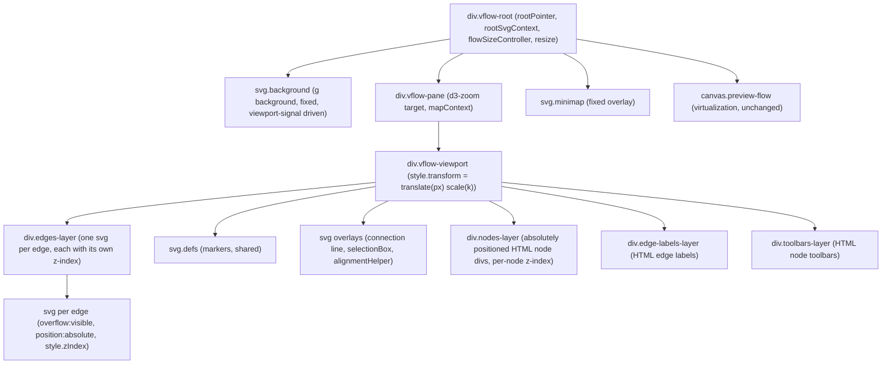

## Native HTML rendering (drop `foreignObject`)

### Goal

HTML renders natively (no `foreignObject`); SVG stays only for curves (edges, connection line, selection box, alignment helper). Zoom/pan keeps using d3, but the transform is applied as a CSS transform to a viewport `
` instead of an SVG `transform` attribute on `<g mapContext>`.

### Decisions (confirmed)

- Drop SVG node types: remove `svg-template`; convert `default-group` (`<rect>`) and `template-group` (`<g>`) to HTML. `nodeSvgTemplate` API and `NodeSvgTemplateDirective` are removed.
- Full migration: preserve toolbars, HTML edge-labels, selection box, connection line, alignment helper, virtualization preview canvas, minimap.

### Target DOM structure

Edges and nodes are siblings inside the viewport, neither layer establishes an isolated stacking context (no `z-index` on `.edges-layer`/`.nodes-layer`), so the per-edge `<svg>` `z-index` and per-node `z-index` compete in the same stacking context and can freely interleave (xyflow behavior).

Nodes are a flat list positioned by `globalPoint()` (group nesting already resolved in flow coords via `NodeModel.globalPoint`), so no DOM nesting is required for groups.

### Layer pointer-events / z-index model (critical — mirrors xyflow `init.css`)

This is what keeps pan/zoom working through the full-size HTML/SVG layers. Get this wrong and the canvas stops panning.

- `.vflow-pane` (d3-zoom target): `z-index: 1`, receives all wheel/drag events.
- `.vflow-viewport`: `transform-origin: 0 0; pointer-events: none` (so the transformed layer never blocks the pane).
- `.edges-layer` container: `position: absolute; pointer-events: none` and NO `z-index` (must stay in the viewport's stacking context). Each edge `<svg>` carries its own `z-index`; the visible/interaction path uses `pointer-events: visibleStroke` (xyflow) so only the stroke is clickable and empty areas pass events through to nodes/pane behind.
- `.nodes-layer`: `pointer-events: none; transform-origin: 0 0` and NO `z-index`; each `.vflow-node` `pointer-events: all` (xyflow sets `none` for nodes with no handlers) and carries its own `z-index`. Because neither `.edges-layer` nor `.nodes-layer` sets a `z-index`, per-edge and per-node `z-index` values interleave in one shared stacking context.
- `.edge-labels-layer` / `.toolbars-layer`: `pointer-events: none`, individual labels/toolbars opt back in with `pointer-events: all`.
- background layer: `z-index: -1; pointer-events: none`.
- Handles: `pointer-events: none` by default, `all` while connecting (matches xyflow `.handle.connectingfrom`).

### Core change: zoom/pan transform target

- [projects/ngx-vflow-lib/src/lib/vflow/directives/map-context.directive.ts](projects/ngx-vflow-lib/src/lib/vflow/directives/map-context.directive.ts): retarget `selector` to the pane `div`; attach `d3-zoom` to the pane div (`zoom<HTMLElement, unknown>()`); change host binding from `[attr.transform]` to `[style.transform]` on the viewport div, emitting `translate(${x}px, ${y}px) scale(${k})`. Set `transform-origin: 0 0` in CSS. The d3 transform object (`{x,y,k}`) and `handleZoom`/start/end logic stay the same.

### Coordinate conversion (screen <-> flow)

- [projects/ngx-vflow-lib/src/lib/vflow/directives/space-point-context.directive.ts](projects/ngx-vflow-lib/src/lib/vflow/directives/space-point-context.directive.ts): replace SVG `getScreenCTM().inverse()` math with pane-rect + viewport math: `flow = (client - paneRect - {x,y}) / k` using `viewportService.readableViewport()`. This drives `documentPointToFlowPoint` and `svgCurrentSpacePoint` (used by connection line).
- Update the public `documentPointToFlowPoint` path in [vflow.component.ts](projects/ngx-vflow-lib/src/lib/vflow/components/vflow/vflow.component.ts) accordingly.

### Root host + directives -> `div`

- [vflow.component.html](projects/ngx-vflow-lib/src/lib/vflow/components/vflow/vflow.component.html) + [vflow.component.scss](projects/ngx-vflow-lib/src/lib/vflow/components/vflow/vflow.component.scss): rebuild template into the layered structure above.
- Retarget directives from `svg`/`g` to `div`, updating selectors and `ElementRef` generics:
  - [reference.directive.ts](projects/ngx-vflow-lib/src/lib/vflow/directives/reference.directive.ts) (`RootSvgReferenceDirective` -> root div ref; rename optional),
  - [root-svg-context.directive.ts](projects/ngx-vflow-lib/src/lib/vflow/directives/root-svg-context.directive.ts),
  - [root-pointer.directive.ts](projects/ngx-vflow-lib/src/lib/vflow/directives/root-pointer.directive.ts) (listen on root div),
  - [flow-size-controller.directive.ts](projects/ngx-vflow-lib/src/lib/vflow/directives/flow-size-controller.directive.ts) (measure root div).

### Nodes -> native HTML

- [node.component.ts](projects/ngx-vflow-lib/src/lib/vflow/components/node/node.component.ts): change selector `g[node]` -> `div[node]`, host `ElementRef<HTMLElement>`, host styles `position:absolute; top:0; left:0; transform-origin:0 0`, bind `[style.transform]` to a new CSS translate.
- [node.component.html](projects/ngx-vflow-lib/src/lib/vflow/components/node/node.component.html): remove all `foreignObject`; render `default` / `html-template` / component nodes as plain `
`; convert `default-group`/`template-group` to HTML divs (border/box styling moved to CSS); delete the `svg-template` branch. Move toolbars out to the HTML toolbars layer.
- [node.model.ts](projects/ngx-vflow-lib/src/lib/vflow/models/node.model.ts): add `pointTransformCss` (`translate(${x}px, ${y}px)`); drop `foWidth`/`foHeight` and the Chrome magic-number; keep `width/height` (still measured by `nodeResizeController`).
- Position binding in [vflow.component.html](projects/ngx-vflow-lib/src/lib/vflow/components/vflow/vflow.component.html) switches from `[attr.transform]="model.pointTransform()"` to `[style.transform]="model.pointTransformCss()"`.

### Handles -> native HTML

- [node.component.html](projects/ngx-vflow-lib/src/lib/vflow/components/node/node.component.html): the visual handle elements (`<svg:circle>` default, magnet circle, custom-template `<svg:g>`) become absolutely-positioned HTML `
`s using `handle.hostOffset()` for `left/top`. Pointer events (`pointerStart`/`pointerEnd`/`pointerOver`/`pointerOut`) stay.
- [handle.model.ts](projects/ngx-vflow-lib/src/lib/vflow/models/handle.model.ts): `hostOffset`/`sizeOffset` math is unchanged (now interpreted as CSS px inside the node div). Host measuring via `offsetLeft/offsetTop/offsetWidth/offsetHeight` ([html-element-cache.service.ts](projects/ngx-vflow-lib/src/lib/vflow/services/html-element-cache.service.ts)) keeps working and is actually simpler/cheaper than xyflow here: xyflow uses `getBoundingClientRect` and must divide by `zoom`, but `offsetLeft/offsetTop` are pre-transform layout values, so NO zoom division is needed. The SVG host-reference path (`SvgGraphicElementCacheService`) becomes effectively unused after SVG nodes are dropped.
- [node.component.scss](projects/ngx-vflow-lib/src/lib/vflow/components/node/node.component.scss): rewrite `.default-handle`, `.magnet`, `.default-group-node` as HTML styles.

### Dragging with zoom

- [draggable.service.ts](projects/ngx-vflow-lib/src/lib/vflow/services/draggable.service.ts): d3-drag now runs on HTML node divs, so `event.x/y` are screen px (not auto-scaled by the old SVG CTM). Following xyflow `XYDrag`, do NOT rely on d3 `event.x/y` deltas; instead recompute the pointer position in flow space from `event.sourceEvent` client coords via the new screen->flow conversion (`(client - rootRect - {x,y}) / zoom`) on every `start`/`drag`. Keep snap-grid, parent-extent, multi-select, and auto-pan logic (auto-pan shifts `lastPos -= movement / zoom`).

### Zoom/drag event filters (re-validate for HTML DOM)

- With the pane as a `
` and HTML nodes, confirm `allowRootZoomForNodeTarget` (d3-zoom `filter`) and the d3-drag `filter` still: (a) allow panning on empty canvas, and (b) suppress panning when interacting with a node/handle. xyflow achieves this with the pointer-events model above plus `nopan`/`nodrag` class checks ([allow-root-zoom-for-node-target.ts](projects/ngx-vflow-lib/src/lib/vflow/utils/allow-root-zoom-for-node-target.ts)).

### Node visibility until measured

- Mirror xyflow: render each node `visibility: hidden` until its dimensions are measured by `nodeResizeController`, to avoid initial flicker and wrong edge endpoints before the first measurement.

### Edges, connection, selection, alignment (SVG, inside viewport)

DECISION (fixed): adopt the xyflow-style **per-edge `<svg>`** approach (not a single shared SVG), so edges and nodes interleave by z-index.

- `.edges-layer`: a `
` with `position:absolute; pointer-events:none` and NO `z-index` (must not create an isolated stacking context). Render one `<svg>` per edge inside it.
- [edge.component.ts](projects/ngx-vflow-lib/src/lib/vflow/components/edge/edge.component.ts): change selector from `g[edge]` to a wrapper that renders its own `<svg style="position:absolute; overflow:visible; pointer-events:none" [style.zIndex]="...">` containing the existing `<g>` content ([edge.component.html](projects/ngx-vflow-lib/src/lib/vflow/components/edge/edge.component.html) paths + reconnect handles, flow coords already correct via `pointAbsolute()`). The interaction path keeps `pointer-events: visibleStroke`/`all`.
- Per-edge `z-index`: derive from the edge model render/elevation order (extend `EdgeModel` with a `renderOrder`/z signal analogous to `NodeModel.renderOrder`), honoring `elevateEdgesOnSelect`. Nodes already get a per-node `z-index` from `renderOrder`; both must be emitted as real CSS `z-index` so they share one stacking context.
- Shared `<defs flowDefs>`: render once as its own `<svg class="defs">` inside the viewport (xyflow renders `MarkerDefinitions` as a standalone `<svg>`; `url(#id)` marker refs are document-global).
- Connection line, `selection-box`, `alignment-helper` stay SVG but move to a dedicated overlay `<svg>` (flow coords). Give the connection-line overlay a high `z-index` (xyflow uses ~1001 for `.connectionline`) so it draws above edges/nodes while connecting.

### HTML edge labels

- [edge-label.component.ts](projects/ngx-vflow-lib/src/lib/vflow/components/edge-label/edge-label.component.ts) + [.html](projects/ngx-vflow-lib/src/lib/vflow/components/edge-label/edge-label.component.html): change from `g[edgeLabel]`/`foreignObject` to an HTML `
` positioned with `transform: translate(labelPoint)` rendered in the dedicated `.edge-labels-layer` (lifted out of the edges SVG). Size measurement keeps using `BasicElementCacheService` (drop the Chrome magic-number).

### Toolbars (HTML overlay)

- Render node toolbars (`overlaysService.nodeToolbarsMap`) as HTML in the `.toolbars-layer`, positioned by `toolbar.transform()`/`toolbar.size()` instead of `foreignObject`.

### Resizer -> HTML

- [resizable.component.html](projects/ngx-vflow-lib/src/lib/vflow/public-components/resizable/resizable.component.html) (+ ts/scss): rewrite the SVG `<line>`/`<rect>` resizer as HTML border/corner handle `
`s, keeping `(pointerStart)` -> `startResize(...)` directions.

### Background & minimap

- [background.component.ts](projects/ngx-vflow-lib/src/lib/vflow/components/background/background.component.ts): stays a fixed full-size SVG layer driven by viewport signals; retarget its `RootSvgReferenceDirective` usage (background-color now set on the root/background element).
- [minimap.component.html](projects/ngx-vflow-lib/src/lib/vflow/public-components/minimap/minimap.component.html): move to a fixed positioned overlay `<svg>` (currently injected inside the root svg). Replace its node-preview `foreignObject` with `<rect>` previews to keep it fully SVG.

### Cleanup / API changes

- Remove `svg-template` from [node.interface](projects/ngx-vflow-lib/src/lib/vflow/models/node.model.ts) types, `NodeSvgTemplateDirective` and `nodeSvgTemplate` inputs (template.directive + vflow.component), and the `MAGIC_NUMBER_TO_FIX_GLITCH_IN_CHROME` usages. Update `public-api.ts` and demo references if needed.

### Validation

- Build the lib and run the demo; verify: zoom/pan, node drag at non-1 zoom, edge endpoints/handles alignment, connection creation + reconnect, selection box, alignment helper, group nodes, resizing, toolbars, edge labels, minimap, virtualization.

### Implementation checklist

1. Rebuild `vflow.component` template/scss into the layered DOM (root div, background svg, pane div, viewport div, edges layer, html nodes/labels/toolbars layers, minimap/canvas overlays).
2. Update `MapContextDirective` to attach d3-zoom to the pane div and apply CSS transform (translate px + scale) to the viewport div.
3. Rewrite `SpacePointContextDirective` + public `documentPointToFlowPoint` to use pane-rect/viewport math instead of SVG CTM.
4. Retarget root directives (reference, root-svg-context, root-pointer, flow-size-controller) from svg/g to div.
5. Convert `node.component` to `div[node]` with native HTML rendering; remove foreignObject and svg-template; migrate groups to HTML; add `pointTransformCss` to `NodeModel`.
6. Render node handles + magnet as absolutely-positioned HTML elements; update node scss.
7. Update `DraggableService` to recompute drag position in flow space from sourceEvent client coords (divide by zoom), like xyflow `XYDrag`; keep auto-pan/snap/extent.
8. Re-validate d3-zoom filter (`allowRootZoomForNodeTarget`) and d3-drag filter for the HTML DOM: empty canvas pans, node/handle interactions do not pan.
9. Per-edge SVG: wrap each edge in its own `position:absolute overflow:visible` svg with CSS z-index (from `EdgeModel` renderOrder + `elevateEdgesOnSelect`); edges-layer div has no stacking context so edges/nodes interleave by z-index.
10. Render shared defs/markers as a standalone svg; move connection-line/selection-box/alignment-helper to a dedicated overlay svg (connection line high z-index).
11. Convert edge labels to HTML divs in a dedicated edge-labels layer.
12. Render node toolbars as HTML in a toolbars overlay layer.
13. Rewrite `ResizableComponent` resizer from SVG to HTML handles.
14. Keep background as fixed SVG layer; move minimap to fixed overlay svg and replace its foreignObject previews with rects.
15. Remove `svg-template` type, `NodeSvgTemplateDirective`/`nodeSvgTemplate`, Chrome magic-number; update public-api and demos.
16. Build lib + run demo; validate zoom/pan/drag/handles/edges/labels/groups/resize/toolbars/minimap/virtualization.
